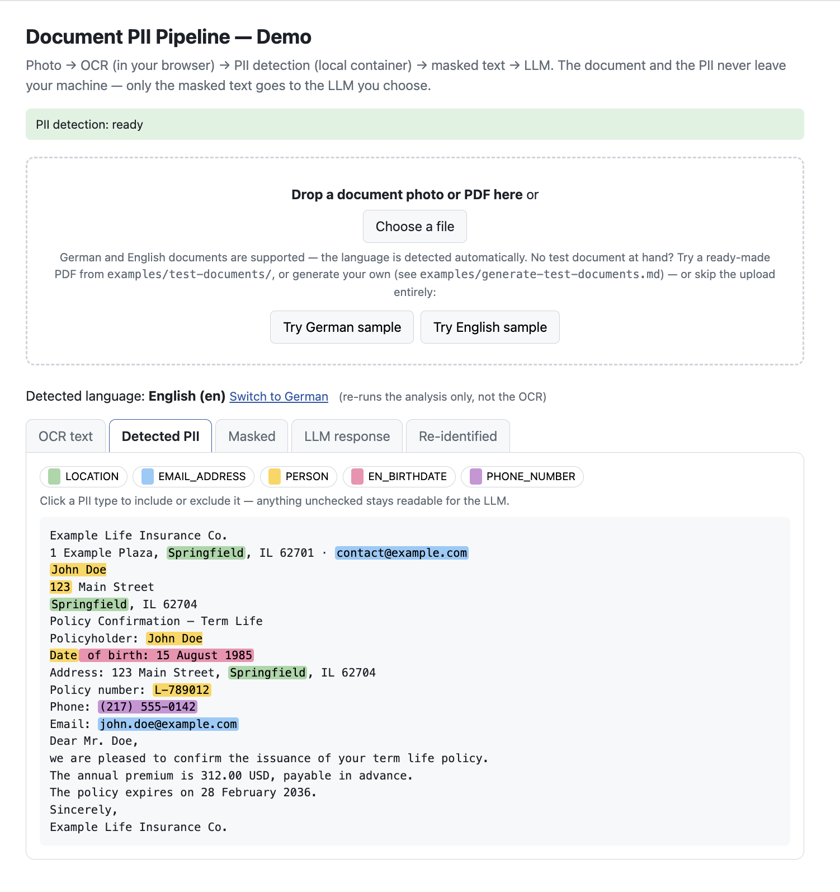
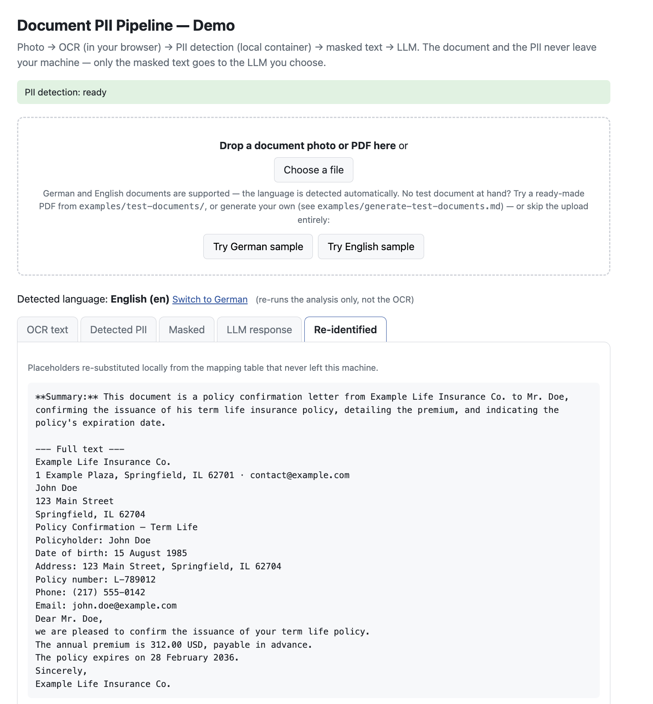

# document-pii-pipeline


> **OCR → PII masking → LLM.** The document stays local, the PII never
> reaches the model. German configs battle-tested; the structure is
> language-agnostic.

The document and the PII never leave your machine — only the masked text
goes to the LLM you choose. English works out of the box via spaCy's
built-in recognizers — the battle-tested custom recognizers are German;
contributions welcome.



## Why

Legal and insurance documents are PII by nature — names, addresses, birth
dates, IBANs are not the exception in these texts, they are the content.
Sending client documents verbatim to a cloud LLM is therefore off the table
in most professional contexts, while running a capable LLM fully on-premise
is out of reach for most small teams. This repo documents the middle path:
OCR and PII detection run locally, and only masked text ever leaves the
machine.

## Prerequisites

**Docker Compose ≥ 2.24** — that is the whole list. No Python, no Node on
your machine: everything runs inside the containers, and the spaCy models
are baked into the image rather than downloaded at runtime.

## Setup

```bash
git clone https://github.com/thomasbln/document-pii-pipeline.git
cd document-pii-pipeline
docker compose up --build
```

What to expect on the first run:

- The **build runs once** and pulls the analyzer image plus the two pinned
  spaCy models (~600 MB). Later starts reuse it.
- The **boot takes ~90 seconds** — the analyzer loads its NLP models eagerly
  at startup, not lazily on the first request. The demo page shows the
  status; wait for **"PII detection: ready"**.
- OCR happens **in your browser** (tesseract.js fetches its German and
  English language data from a CDN on first use). The recognized text is
  only ever POSTed to the analyzer container on your own machine.

Then open **http://localhost:8080**. For an immediate result, drag a
ready-made PDF from [examples/test-documents/](examples/test-documents/)
onto the page — or press **Try German sample** and skip the upload
entirely. Your own document works too: drop a photo or a PDF. To build a
safe test document from scratch, see
[examples/generate-test-documents.md](examples/generate-test-documents.md).

Prefer the API? The analyzer speaks plain JSON:

```bash
# German text: "Max Mustermann lives in Berlin."
curl -s -X POST http://localhost:8080/analyze \
  -H 'Content-Type: application/json' \
  -d '{"text": "Max Mustermann wohnt in Berlin.", "language": "de",
       "entities": ["PERSON", "LOCATION"]}'
# → character spans, one per hit:
#   [{"entity_type": "PERSON",   "start": 0,  "end": 14, "score": 0.85, …},
#    {"entity_type": "LOCATION", "start": 24, "end": 30, "score": 0.85, …}]
```

Full smoke tests — including the `allow_list` and the documented false
positive — live in
[examples/curl-examples.sh](examples/curl-examples.sh).

### Optional: the LLM step

Everything above works without an LLM. Sending the masked text to a model
needs a one-time setup — three steps:

1. **Copy the template:** `cp .env.example .env`
2. **Set your key** in `.env`: `LLM_API_KEY=...` (and `LLM_BASE_URL` /
   `LLM_MODEL` if you are not on OpenAI — Anthropic and a local Ollama are
   shown as alternatives in the file).
3. **Restart the proxy:** `docker compose up -d --force-recreate caddy`

```bash
cp .env.example .env
$EDITOR .env                                    # set LLM_API_KEY
docker compose up -d --force-recreate caddy
```

The key is attached server-side by the local proxy and never reaches the
browser. Without a `.env` the demo still works up to the masked-text tab;
the LLM step simply reports "not configured".

## How it works

```
┌────────────────────────── your machine ──────────────────────────┐
│                                                                  │
│  photo/PDF ─► tesseract.js ─► raw text ─► Presidio ─► PII spans  │
│              (OCR in the     POST          analyzer        │     │
│               browser)       /analyze      (Docker, de/en  │     │
│                                             NER + regex)   │     │
│                                                            │     │
│   masked text — numbered placeholders ◄────────────────────┘     │
│      │                                                           │
│      │     re-identified answer ◄── local re-substitution ◄─┐    │
│      │     (the mapping table never leaves this machine)    │    │
└──────┼──────────────────────────────────────────────────────┼────┘
       ▼                                                      │
  your LLM (cloud or local) ─── response with placeholders ───┘
  sees "[PERSON_1], born [DE_BIRTHDATE_1]" — never the real values
```

![The demo's "Masked" tab: the same John Doe letter with every detected value replaced by a numbered placeholder such as [PERSON_1] or [EMAIL_ADDRESS_2], above it the prompt and model fields and the send button.](./assets/demo-2-masked.png)

*This is all the provider ever sees. (You can also spot the documented
over-masking here — a policy number caught as `PERSON`, spans glued across
line breaks: see [Honest limitations](#honest-limitations). Nothing leaks —
the masking errs toward hiding too much.)*

PDFs work too — a digital PDF's text layer is extracted directly in the
browser (skipping the OCR step entirely), while scanned PDFs are rendered
to images and go through the same OCR.

The compose stack runs two containers:

- **`presidio-analyzer`** — [Microsoft Presidio](https://github.com/microsoft/presidio)
  with pinned German and English spaCy models and custom recognizers
  (`DE_ADDRESS`, `DE_BIRTHDATE`, `EN_BIRTHDATE`); English requests
  otherwise run on the built-ins.
- **`caddy`** — serves the static demo page *and* reverse-proxies
  `/analyze` to the analyzer under the **same origin**
  (`http://localhost:8080`). That is a deliberate choice, not decoration:
  the obvious alternative — publish the analyzer's port 3000 and open the
  demo straight from `file://` — fails on CORS (the browser blocks the
  cross-origin POST). So the analyzer publishes no host port at all, and
  Caddy puts demo and API behind one origin; the demo works out of the box.

The masking step is trivially simple by design — the analyzer returns
character spans, and the client replaces them with numbered placeholders.
What goes to the LLM is the masked text and only that; re-identification
of the response happens locally, from a mapping table that never leaves
your machine. The provider key never touches the browser either — the
local Caddy attaches it server-side to `/llm/*` requests (`.env` →
compose → Caddy). The send step needs a one-time setup — see
[Optional: the LLM step](#optional-the-llm-step) in the Setup section;
without it the demo ends at the masked-text tab. The demo's legend
doubles as a minimal masking policy:
choose per entity type what the LLM may see — unchecked types stay in the
text unmasked.

In principle the whole round trip is these few lines — mask, send, restore:

```python
spans = analyze(text)                       # POST /analyze  (local container)
masked, mapping = mask(text, spans)         # [PERSON_1], [IBAN_CODE_1], …
answer = ask_llm(prompt, masked)            # the ONLY step that leaves the machine
final = restore(answer, mapping)            # placeholders → real values, locally
```

`mapping` is the one thing you must keep local — it is what turns the
pseudonymization back into plain text. A runnable version in three acts
(mask locally, send the masked text, re-substitute locally) is
[examples/llm-roundtrip.sh](examples/llm-roundtrip.sh).



*Re-identified locally — the mapping table never left the machine.*

## What's in the repo

```
document-pii-pipeline/
├── docker-compose.yml   ← the two containers, and why the analyzer has no host port
├── .env.example         ← optional LLM config; the key stays server-side
├── assets/              ← the three demo screenshots used in this README
├── caddy/
│   └── Caddyfile        ← serves the demo, proxies /analyze and /llm on one origin
├── presidio/
│   ├── Dockerfile       ← pinned image, models baked in, not downloaded (see trap 4)
│   └── conf/de/         ← the battle-tested German core; also enables English
│       ├── analyzer.yaml  ← languages (de, en) and the 0.4 score threshold
│       ├── nlp.yaml       ← spaCy models and the PER→PERSON mapping (see trap 2)
│       └── registry.yaml  ← the custom DE and EN recognizers (see trap 3)
├── demo/
│   └── index.html       ← the whole demo, one static file: OCR, masking, LLM, restore
└── examples/
    ├── curl-examples.sh ← five smoke tests, incl. allow_list and the false positive
    ├── llm-roundtrip.sh ← mask locally, send masked, re-substitute locally
    ├── test-documents/  ← four ready-made PDFs, Mustermann/Doe class
    └── generate-test-documents.md  ← prompts for building your own safe test documents
```

The `conf/de/` directory is language-scoped on purpose. The traps and the
structure are not German-specific — **contributions of `conf/fr/`,
`conf/es/`, … with battle-tested configs for other languages are very
welcome.**

## The five traps

Everything below happened for real while putting this pipeline into
production use. Each trap: **symptom → cause → fix**.

### 1. Presidio reads THREE config files via THREE env vars — a consolidated one is silently ignored

**Symptom:** You write one clean, consolidated YAML with the analyzer
settings, the NLP config and your custom recognizers, mount it, and the
container boots green — but behaves as if your config didn't exist: default
entities only, your recognizers are simply not there. No warning, no error.

**Cause:** The analyzer's entrypoint reads **three separate files through
three separate environment variables** — `ANALYZER_CONF_FILE`,
`NLP_CONF_FILE` and `RECOGNIZER_REGISTRY_CONF_FILE`. Sections that live in
a file not wired through exactly these variables are never read. This cost
three full rebuild-and-boot loops before the cause was found, because
nothing ever fails — the defaults just win silently.

**Fix:** Split the configuration into three files and set all three
variables explicitly:

```dockerfile
ENV ANALYZER_CONF_FILE=/app/conf/analyzer.yaml
ENV NLP_CONF_FILE=/app/conf/nlp.yaml
ENV RECOGNIZER_REGISTRY_CONF_FILE=/app/conf/registry.yaml
```

### 2. spaCy's German models emit the label `PER` — without a `PER→PERSON` mapping you get zero person hits

**Symptom:** German text containing perfectly obvious names ("Max
Mustermann") returns **zero `PERSON` entities**. IBANs and emails are found
(those are pattern recognizers), so the pipeline looks "mostly working" —
which makes this trap especially treacherous.

**Cause:** spaCy's German models label persons as `PER`, but Presidio
filters results against its own entity name `PERSON`. Without an explicit
mapping, every person hit is silently dropped between the NER model and the
API response.

**Fix:** Map the model's labels to Presidio's entity names in `nlp.yaml`:

```yaml
ner_model_configuration:
  model_to_presidio_entity_mapping:
    PER: PERSON        # spaCy DE emits "PER" — without this line: zero person hits
    LOC: LOCATION
    GPE: LOCATION
    ORG: ORGANIZATION
```

While you are in this file: write `labels_to_ignore` out **explicitly**
instead of relying on the image default. The desired behavior (e.g.
organization names surviving the masking so the text stays readable) should
not hinge on an implicit default that can drift between versions.

### 3. `type: custom` does not exist — the loader passes YAML fields verbatim into the constructor

**Symptom:** The analyzer crashes at boot after you add custom pattern
recognizers following the documented registry schema:

```
TypeError: PatternRecognizer.__init__() got an unexpected keyword argument 'type'
```

**Cause:** The registry loader does not consume a `type` discriminator for
custom entries — it passes **all** YAML fields of a type-less entry verbatim
as keyword arguments into `PatternRecognizer.__init__()`. Your `type: custom`
field (as shown on the docs page) is forwarded too, and the constructor
rejects it. A custom recognizer is marked by the **absence** of `type`;
`type: predefined` is only meaningful for built-ins. The authoritative
schema is the example file shipped *inside the image*, which differs from
the docs page.

**Fix:** Remove `type: custom`. Two further quirks of custom entries,
confirmed against the in-image example: `supported_language` is **singular**
(built-ins use plural `supported_languages`), and regex backslashes must be
double-escaped in double-quoted YAML:

```yaml
# Custom recognizer: NO "type" field — its absence is what marks it as custom.
- name: "DE Address Recognizer"
  supported_language: "de"          # singular for custom entries!
  supported_entity: "DE_ADDRESS"
  patterns:
    - name: "street with number"    # German street suffixes: -straße, -weg, -platz, ...
      regex: "([A-ZÄÖÜ][\\wäöüß.-]*(?:straße|strasse|str\\.|weg|allee|platz|gasse|ring|damm|ufer)\\s+\\d{1,4}[a-z]?)"
      score: 0.6
```

**Debugging tip that generalizes:** when a config crashes a containerized
service at boot, don't iterate blind `docker compose up` loops. Start the
service manually inside its own environment (here: `poetry run ...` inside
the container) to get the real traceback, and read the schema example
shipped in the artifact (`find / -name "*example*"` inside the container)
before trusting the docs page.

### 4. Plain `pip install` in the image lands in the wrong Python environment

**Symptom:** The image builds fine, but **every container start re-downloads
the ~570 MB German model** — the boot log shows `Downloading
de_core_news_lg...` on each and every boot, unpinned, from the network.

**Cause:** The Presidio image contains **two Python environments**. A plain
`RUN pip install ...` installs the model into `/usr/local/...`, where the
application's environment (managed by poetry) never looks. At runtime the
model is "missing", so it gets re-downloaded into the ephemeral container
filesystem — again on every fresh container.

**Fix:** Install through the application's own environment, pinned. This
happens **inside the image at build time** — nothing is installed on your
machine:

```dockerfile
# in presidio/Dockerfile
RUN poetry run pip install --no-cache-dir \
    https://github.com/explosion/spacy-models/releases/download/de_core_news_lg-3.8.0/de_core_news_lg-3.8.0-py3-none-any.whl
```

Verification is one look at the boot log: no `Downloading...` line anymore.

### 5. tesseract.js defaults to PSM 6 — which halves recall on document layouts

**Symptom:** On phone photos of real documents, OCR recall on the fields
that matter (contract numbers, reference numbers) sits around **50%**.
Multi-column layouts get interleaved mid-number; numbers printed in comb/box
fields come back with inserted digits. It looks like "tesseract just isn't
good enough" — and tempts you into a wrong architecture decision (falling
back to a cloud vision API, defeating the point of a local pipeline).

**Cause:** tesseract.js does not set a page segmentation mode at all, so the
Tesseract **API default PSM 6 (single uniform block)** applies — *not* the
CLI default PSM 3 (auto) that tutorials and CLI experience suggest. PSM 6
presses multi-column, sparse document layouts into one text block; both
miss classes above are segmentation artifacts, not character-recognition
limits.

**Fix:** Set **PSM 11 (sparse text)** explicitly:

```js
await worker.setParameters({
  tessedit_pageseg_mode: Tesseract.PSM.SPARSE_TEXT, // PSM 11 — see below
});
```

In a settings sweep over the same photo set, PSM 11 took the critical-field
recall from **~50% to 100%** — including the comb-field number that was
expected to stay broken. (Bonus finding from the same sweep: the `best`
traineddata model scored *zero* points better than `fast` at 2.2× the
runtime — measure, don't assume.)

The general rule behind this trap: **library defaults are a measurement
subject, not a given.** Before integrating an engine-like library, sweep the
relevant settings against your own real data.

## Honest limitations

Read this section before trusting the pipeline with anything sensitive.

- **A missed entity is a leak.** This pipeline performs *pseudonymization*,
  not anonymization: every entity the NER model or the regex recognizers
  fail to detect goes to the LLM verbatim. NER recall is never 100%. Treat
  the masking as risk reduction, not as a guarantee — and do not call it
  "anonymized" in a GDPR sense.
- **OCR is the ceiling.** Tesseract is a print-OCR engine: handwritten
  text is out of scope, and comb/box form fields fragment even printed
  characters. On such documents PII survives unmasked — check the raw-text
  tab (low-confidence words are grayed) before trusting the masked output.
- **The regex recognizers have known false negatives.** The `DE_ADDRESS`
  pattern matches streets by their suffix (`-straße`, `-weg`, `-platz`, …).
  Suffix-less German street names — `Am Hang 3`, `Zur alten Mühle 7` — are
  not matched. Extending the pattern is a deliberate trade-off against false
  positives.
- **Over-masking happens too.** German dot-dates with a leading zero
  (e.g. `05.03.2026`) can get co-masked as `PHONE_NUMBER` at the 0.4
  threshold edge — fail-safe (nothing leaks), but expect it on real
  documents. Likewise, NER spans can swallow an adjacent field label —
  even across a line break, since the model treats a newline as ordinary
  whitespace (`John Doe\nDate` comes back as one `PERSON`). Again
  over-masking, nothing leaks.
- **Scores are not confidence.** spaCy NER hits arrive with a flat score of
  0.85 — a false positive (e.g. the document label `Versicherungsschein-Nummer`,
  German for "insurance policy number", tagged as `PERSON`) scores exactly
  the same as a real name. Do not build thresholds or review queues on the
  assumption that the score is a calibrated confidence signal; it isn't.
  Use the request-side `allow_list` for known document labels instead (see
  `examples/curl-examples.sh`).
- **The English path is not battle-tested.** `EN_BIRTHDATE` exists as a
  label-anchored sibling of `DE_BIRTHDATE`, but no eval corpus stands
  behind it yet. An `EN_ADDRESS` counterpart does not exist at all —
  US/UK address formats are structurally harder than German street
  suffixes; contributions welcome. The German configs have been through
  production hardening; the English ones have not.
- **The demo's language auto-detection is a simple heuristic** (umlauts plus
  stop words). Full documents detect reliably; short texts can be
  misdetected — use the manual override next to the detected language.
- **Placeholder collisions.** Presidio does not number placeholders —
  naive `[PERSON]` masking is ambiguous on re-substitution as soon as a
  document mentions two names. Demo and script therefore number the
  placeholders client-side (`[PERSON_1]`, `[PERSON_2]`, …) and keep the
  mapping table local.

## Platform notes

The analyzer image is amd64-only (upstream ships no ARM build):

- **Windows / Linux on Intel or AMD** — runs natively.
- **Apple Silicon (M-series Macs)** — runs via Docker's built-in emulation:
  works out of the box, the first boot is just slower.
- **ARM Linux** — not supported.

## License

MIT.

Built by [Thomas Rehmer](https://github.com/thomasbln). If you work with
legal documents and LLMs, you may also be interested in
[Lex Orchestra](https://github.com/thomasbln/Lex-Orchestra).
